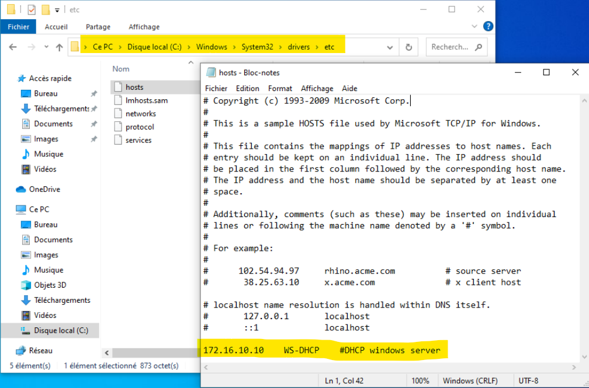
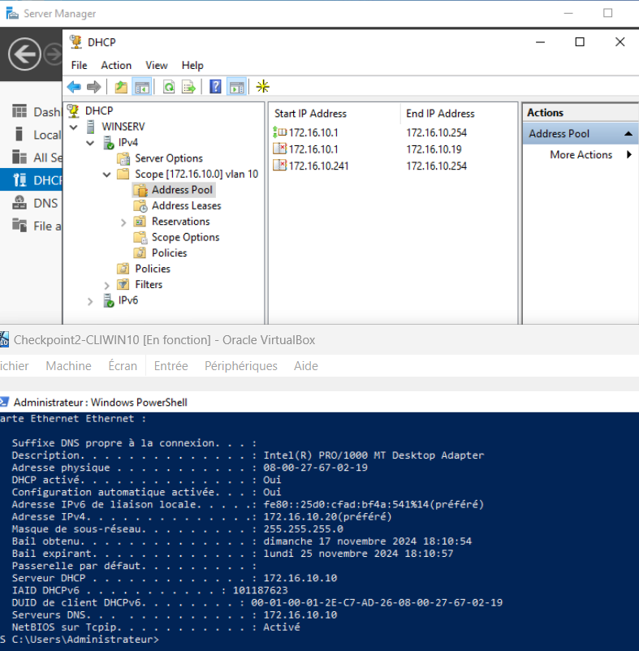

**Q.1.1 Pourquoi le ping avec les adresses IP des machines ne fonctionnent pas ?**

Le serveur et le client ne sont pas sur le même réseau. 

**Modifie la configuration sur le client pour que cela soit possible.**

Nouvelle adresse ip du client : 172.16.10.50

**Explique ce que tu as fait et montre le par des copies d'écran.**
Faire un clic droit sur le menu "Démarrer puis cliquer sur Connexions Réseaux ensuite sur Centre de réseaux et de partage puis modifier les parfamètres de la carte, clic droit du Ethernet psui sur Protocol Internet IPV4 puis Propriété". 

**Copie d'écran d'un ping fonctionnel.**

**Q.1.2 Ping entre les 2 machines qui fonctionne avec le nom**

**Q.1.3 Adresse IP prise par le client**
La plage d'adresse de 172.16.10.1 à 172.16.10.19 est exclue de l'adressage.

Le client récupère l'adresse 172.16.10.20, correspondant à la première adresse disponible dans la plage.

