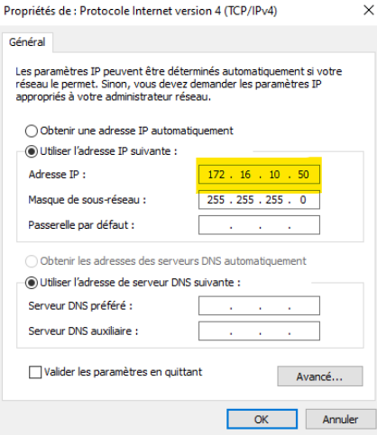
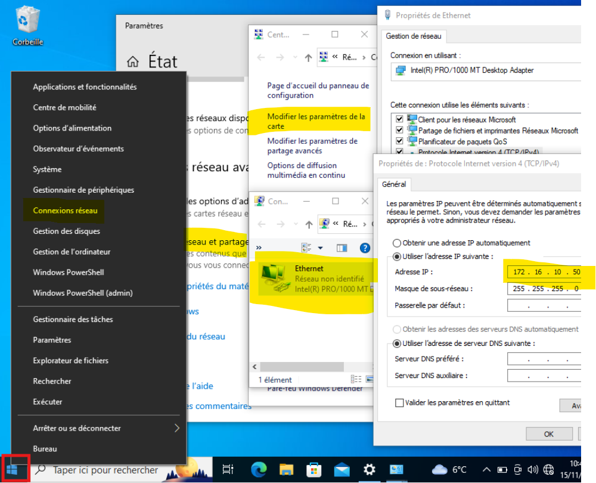
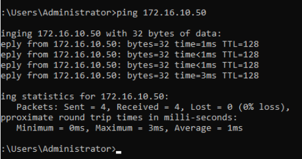

**Q.1.1 Pourquoi le ping avec les adresses IP des machines ne fonctionnent pas ?**

Le serveur et le client ne sont pas sur le même réseau. 

**Modifie la configuration sur le client pour que cela soit possible.**

Nouvelle adresse ip du client : 172.16.10.50

Explique ce que tu as fait et montre le par des copies d'écran.
Faire un clic droit sur me menu "Démarrer puis cliquer sur Connexions Réseaux ensuite sur Centre de réseaux et de partage

On doit avoir la copie d'écran d'un ping fonctionnel.

**Q.3.1 Quel est le matériel réseau A ?** Le matériel réseau A est un switch.
**Quel est son rôle sur ce schéma vis-à-vis des ordinateurs ?**
Le rôle du switch est de recevoir du routeur du réseau B des données sous forme de paquets et de 
déterminer où ces paquets doivent être envoyés en fonction des adresses MAC des ordinateurs de manière intelligente et efficace tout en réduisant les collisions.

**Q.3.2 Quel est le matériel réseau B ?** Le matériel du réseau B est un routeur.
Quel est son rôle pour le réseau 10.10.0.0/16 ?

**Q.3.3 Que signifie f0/0 et g1/0 sur l’élément B ?**
- f0/0 signifie que c'est l'interface physique FastEthernet qui fonctionne à une vitesse de 100 Mbps (avec le 0 en numéro de slot et le second 0 en numéro de l'interface.) 
- g1/0 signifie que c'est l'interface physique GigaEthernet de type Gigabit Ethernet qui fonctionne à une vitesse de 1Gbps (avec le 1 en numéro de slot et le second 0 en numéro de l'interface.)  

**Q.3.4 Pour l'ordinateur PC2, que représente /16 dans son adresse IP ?** (@IP : 10.11.80.2/16)
Le /16 représente le masque de sous-réseau de 255.255.0.0. 
Ce qui signifie que la partie réseau de l'adresse IP 10.11.80.2 va couvrir les deux premiers octets (10.11), et les deux derniers octets (80.2) seront utilisés pour adresser des hôtes dans ce réseau.
Le réseau 10.11.0.0/16 pourrait donc contenir des adresses IP allant de 10.11.0.1 à 10.11.255.254 (ce qui donne 65 536 adresses possibles pour les hôtes).

